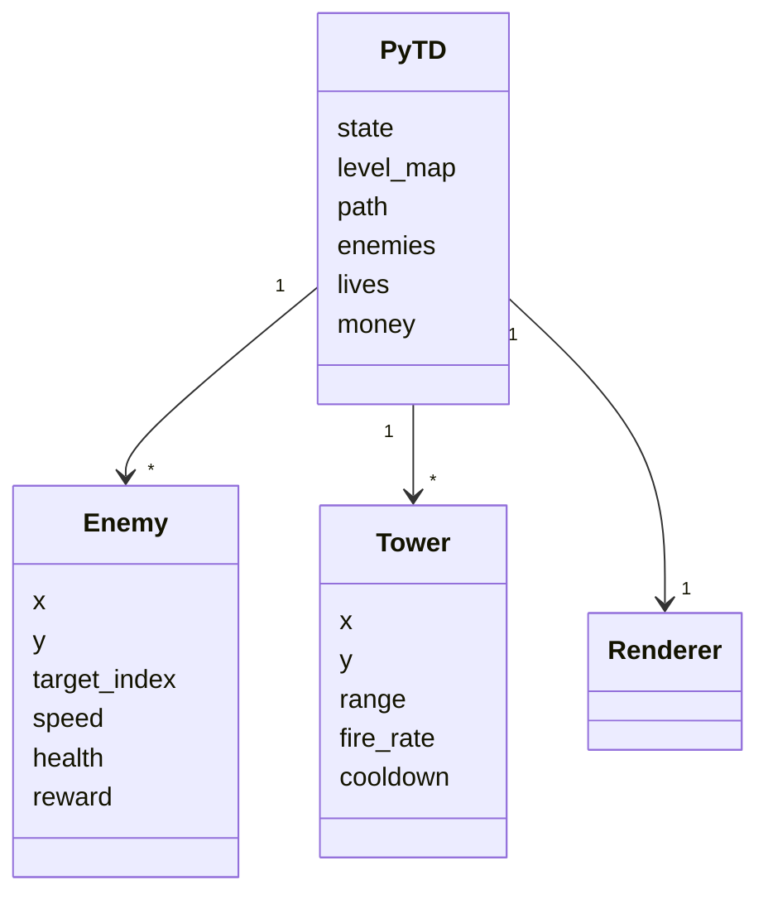
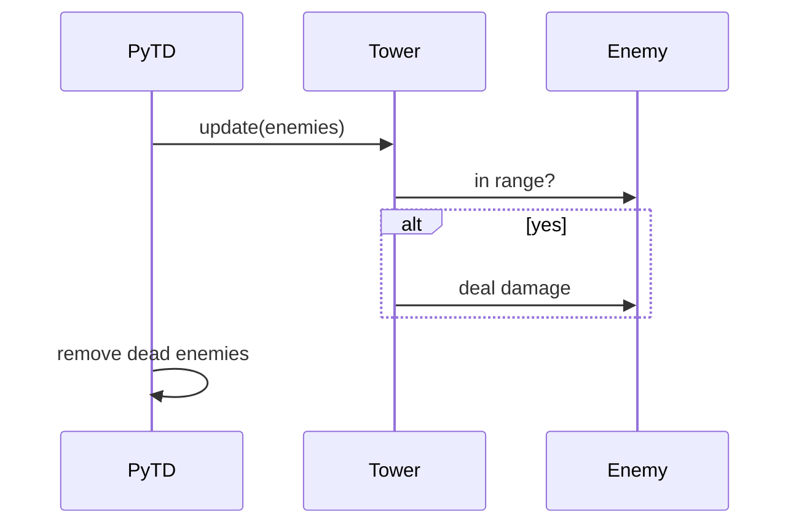

# Arkkitehtuurikuvaus

## Rakenne

Sovelluksen rakenne kaaviona oleellisilla luokilla

```mermaid
classDiagram
    PyTD "1" --> "*" Enemy
    PyTD "1" --> "*" Tower
    PyTD "1" --> "1" Renderer


    class PyTD {
        state
        level_map
        path
        enemies
        lives
        money
    }

    class Enemy {
        x
        y
        target_index
        speed
        health
        reward
    }

    class Tower {
            x
            y
            range
            fire_rate
            cooldown
        }

    class Renderer {
    }
```

Sekvenssikaavio tornien ja vihollisten vuorovaikutuksesta

```mermaid
sequenceDiagram
    participant Game as PyTD
    participant Tower
    participant Enemy

    Game->>Tower: update(enemies)

    Tower->>Enemy: in range?
    
    alt yes
        Tower->>Enemy: deal damage
    end

    Game->>Game: remove dead enemies
```

