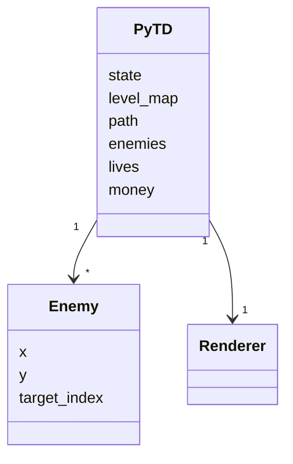

# Arkkitehtuurikuvaus

## Rakenne

Sovelluksen rakenne kaaviona oleellisilla luokilla

```mermaid
classDiagram
    PyTD "1" --> "*" Enemy
    PyTD "1" --> "1" Renderer

    class PyTD {
        state
        level_map
        path
        enemies
        lives
        money
    }

    class Enemy {
        x
        y
        target_index
    }

    class Renderer {
    }
```
