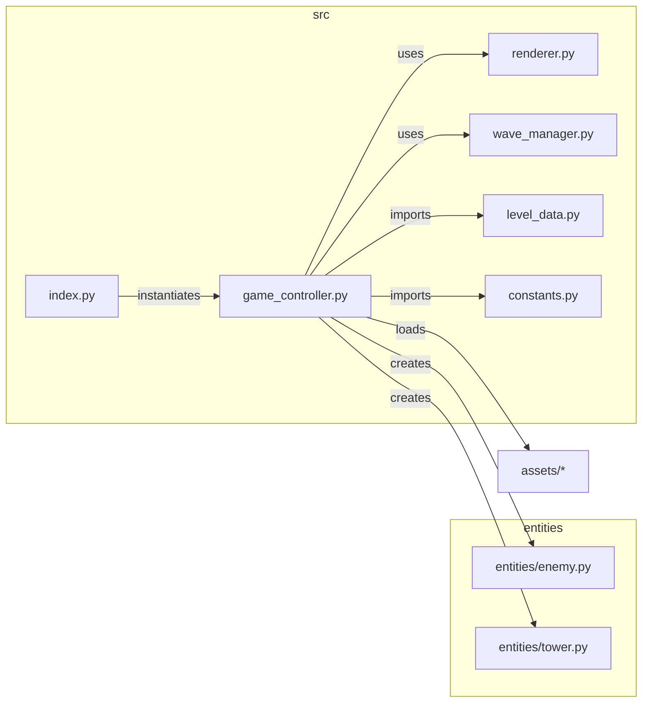
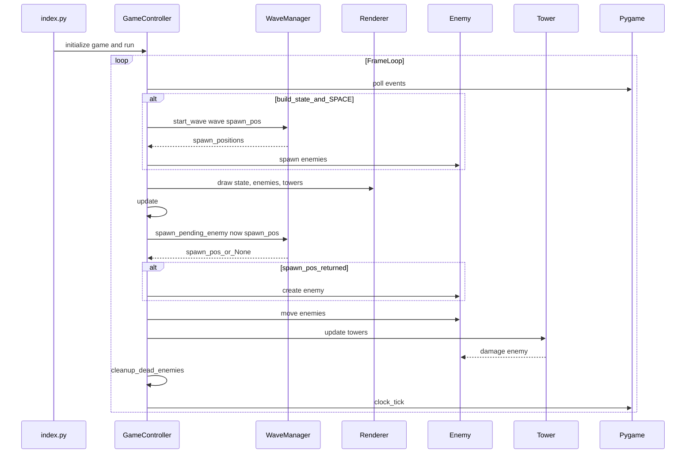
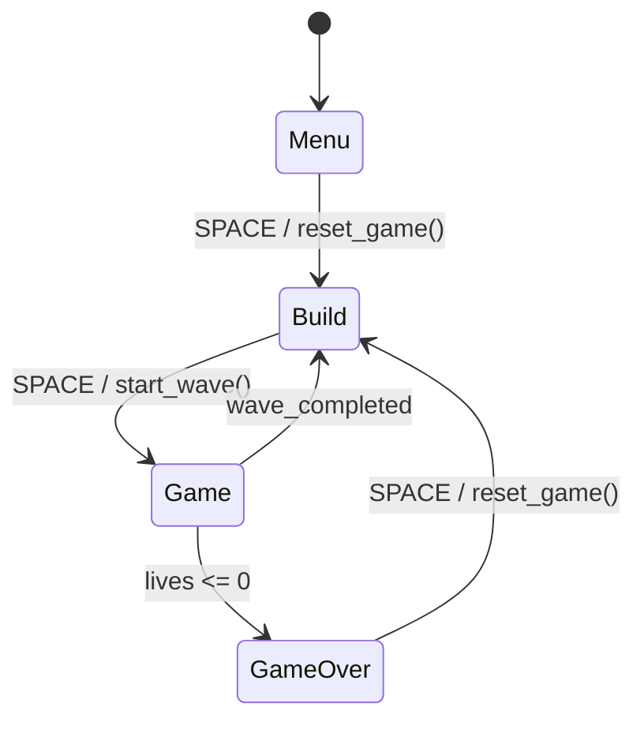

# Arkkitehtuurikuvaus

## Pakkauskaavio

Sovelluksen modulaarinen rakenne ja keskeiset riippuvuudet.

[GameController](https://github.com/laitiii/ot-harjoitustyo/blob/main/src/game_controller.py) on sovelluksen keskus: se lataa "asetukset" [constants](https://github.com/laitiii/ot-harjoitustyo/blob/main/src/constants.py), tason [level_data](https://github.com/laitiii/ot-harjoitustyo/blob/main/src/level_data.py), alustaa [renderer](https://github.com/laitiii/ot-harjoitustyo/blob/main/src/renderer.py) ja käyttää [wave_manager](https://github.com/laitiii/ot-harjoitustyo/blob/main/src/wave_manager.py) instanssia. Entiteetit ovat omassa paketissaan [entities](https://github.com/laitiii/ot-harjoitustyo/tree/main/src/entities) ja luodaan suorituksen aikana.

## Pelisilmukan sekvenssikaavio

Kuvaa yhden frame-päivityksen (≈60 FPS) korkean tason tapahtumat: tapahtumankäsittely, piirtäminen, päivitykset ja spawn-logiikka.

`index.py` käynnistää `GameController.run()` (katso [index.py](https://github.com/laitiii/ot-harjoitustyo/blob/main/src/index.py)). Jokaisella framella tapahtumat luetaan Pygamesta, piirretään tila `Renderer`-luokan kautta, spawn-logiikkaa hoitaa `WaveManager` ja pelilogiikka (liikkeet, tornien hyökkäykset, kuolleiden siivous) tapahtuu `GameController.update()`-metodissa.

## Tilakaavio

Pelin tilojen ja niiden väliset siirtymät.

- `Menu`: päävalikko, jossa käyttäjä aloittaa pelin.
- `Build`: rakenteluvaihe, pelaaja sijoittaa torneja; paina `SPACE` käynnistääksesi aallon (`GameController.start_wave()`).
- `Game`: aktiivinen peli; viholliset spawnaavat ja liikkuvat polkua pitkin, tornit ampuvat.
- `GameOver`: kun `lives` ≤ 0; `SPACE` palauttaa rakenteluvaiheeseen ja resetoidaan peli.
